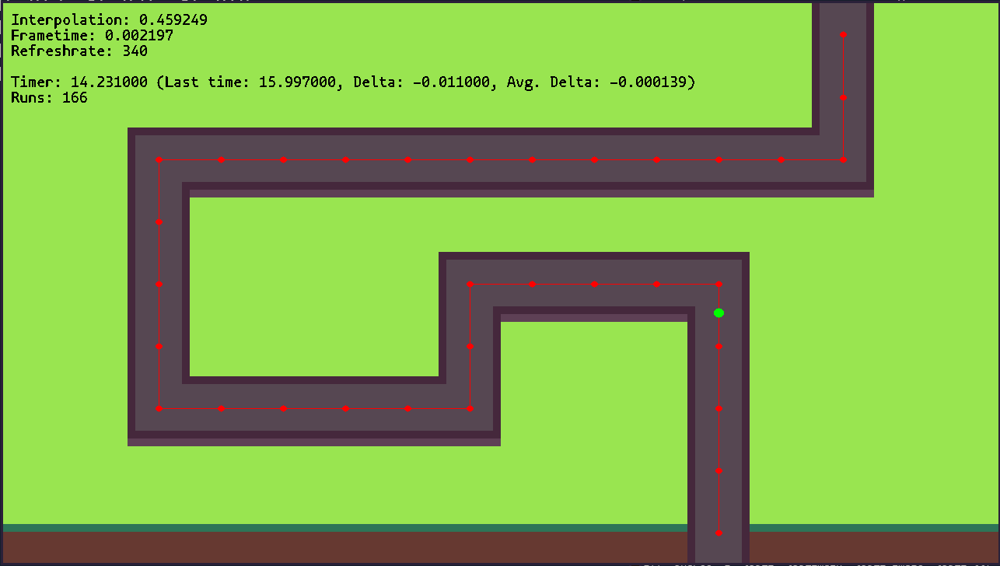

# Birb2D Interpolation Demo
This short demo of a smoothly moving green dot was made to learn how timestep/deltatime works (apparently it wasn't as straight forward as I liked to think to myself). The green dot is supposed to move trough the generated path with the same speed no matter the refreshrate/FPS. In a perfect scenario the average deltatime between the lap times should be extremely close to zero after numerous runs. The average might be a bit higher with lower framerates.

The refreshrate in the demo is randomized for each run. The value is clamped between 5 and 400

